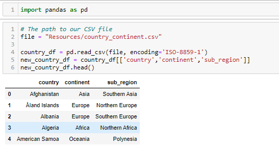
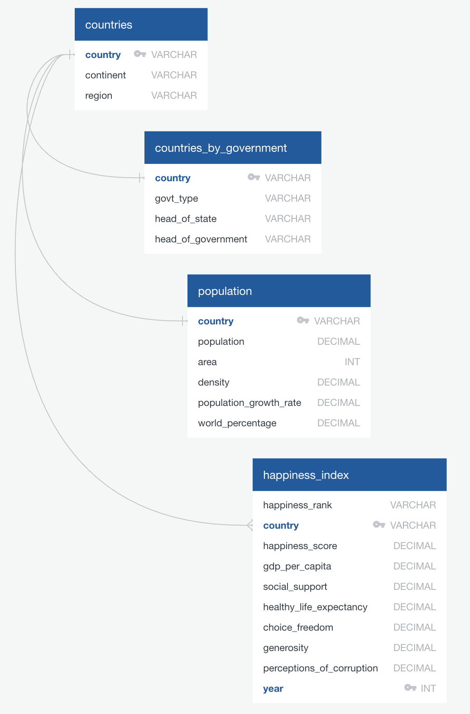

## Happiness Index ETL

## Table of contents
* [General Info](#general-info)
* [Technologies](#technologies) 
* [Extract](#extract)
* [Transform](#transform)
* [Load](#load)
* [Queries](#queries)
* [Run Data](#run-data)
* [Resources](#resources)
* [Contacts](#contacts)

## General Info
Are you looking for more information on your target customer market? Or maybe you are looking for a new place to move? We have the database for you! The **Happiness Database**. Our database compares the Happiness Index of a country and other Geopolitical factors.

What is the Happiness Index? It is a rating of a country’s happiness on a scale of 1 to 10- where 10 is the happiest and 1 is the lease happy. There are a series of questions that are asked, and the sum of the answers is equal to the countries Happiness Score. 

## Technologies

We used the following technologies:

* Pandas

* PostgreSQL

## Extract

Our data came from several sources including CSV files and data pulled from web scraping. 

CSV files:

* [Kaggle- Happiness Index](https://www.kaggle.com/unsdsn/world-happiness) : set of 5 separate csv files of Happiness Score and the factors related to final rating ranging over 5 years from 2015-1029

* [Kaggle- Country Codes](https://www.kaggle.com/statchaitya/country-to-continent) : included country name, specific 2-digit country code and region

* [World Population](https://worldpopulationreview.com/) : included data on country population, growth rate from 1970 to 2030 (prediction based of growth rate)

For our government type data, we web scraped the data from the below site:   
	
* [Government Types](https://www.mapsofworld.com/thematic-maps/types-of-governments.html) : website had a table of current government type and leadership per country

There are 193 countries in the world, however, our main Happiness Index CSV file included 153 counties that were surveyed. We chose these data sets because they all had the common field of Country Name.

## Transform
We imported our data sets into Jupyter Notebook to manipulate and transform our datasets. We had to reformate and clean our CSV files so that they were readable, and the columns were consistent. We did this by renaming columns and comparing country names to ensure all data was callable in our `Postgres` queries. We also removed null values in areas that would not have been meaningful.

### Countries Table

Our country csv was a list of country, continent a region. We renamed the columns to be consistent. 

We also `merged` the Country names against a year of our Happiness Index to make sure the data included the same list of countries.

We saved this database to a csv to use as a master country list in our other data sets for consistency. 

### Government Table

The government table came from Web Scraping as website that had a list of government types by country. We used the pandas code ` pd.read_html( ) ` to read the data in `jupyter notebook` . 

We then cleaned up the column names and `merged` the data with our countries table to make sure the list of countries matched. 

### Happiness Index

The Happiness CSVs we found consisted of 5 CSV files over 5 years of time. We decided not to `aggregate` the data in the csv so that could have a record of all 5 years of Happiness Score. 

Every year of data had different column names, so we had to rename all the CSV files before adding them together. 

Once the columns were consistent, we used the `pandas` function ` pd.concat( ) ` to add the 5 CVS years of data into one master table. 

### Population Table

For our population table, we used a CSV of population over many years including future population predictions. We only need the population of the countries in our data frame, so we remade the table using only 2019 populations. 

Then we cleaned the data further by renaming the columns to be consistent and clear. 

## Export to Postgres

To export the data to `Postgres` we use the following code including ` df.to_sql( ) ` for all notebook. Also, we used `if_exists=”append” ` to add to the existing database without overriding the schema. 

### Schema

To organize our data sets we use an `Entity Relationship Diagram` (ERD)tool from the [Quick Database Diagrams](https://www.quickdatabasediagrams.com/) website. We created sample tables and linked them together on their primary key which was Country Name. We then exported he schema into `Postgres` to create our tables.

When creating our schema, we assigned data types to all the columns based on their values. 

## Load

Within `pgAdmin` , we created tables based on our [schema](https://github.com/Ssimoes48/Happiness-ETL/blob/main/Schema/schema.sql). Then we ran our ` df.to_sql( ) `  in jupyter notebook to import our clean database information into the new tables we made in `postgress` . We also assigned the restriction to certain fields NOT to pull the data if the column was `NULL` . 

Our schema also included constraints to make sure the data connected between tables correctly and on the `PRIMARY KEY` and `FOREIGN KEY` . 

## Queries 

After creating the databases, the following are some [queries](https://github.com/Ssimoes48/Happiness-ETL/blob/main/Schema/query.sql)  the user may find useful.

### Query 1 

Querying the Happiness Score of a country and that country’s government type. This could help show the correlation of a country’s happiness and their government type. To do this, we used an `INNER JOIN` on the happiness_index and countries_by_government tables. We joined them on ‘country’. Because our happiness_index includes 5 years of data, we used the `AVG` function to calculate the average Happiness Score per country so the table only each country 1 time. 

### Query 2 

Querying all of the data in all of the tables. This shows a nice summary by country of Happiness Index and Geopolitical data. To combine all of the tables, we had to do 3 `INNER JOINS` to connect all 4 tables. We also had to `GROUP BY` the country to make the data show only 1 time per country. We used `AVG` to calculate the average of numerical values to the 1 entry per county would be accurate regarding happiness index. We also used `ORDER BY` to sort our data by ‘region’. This helped to group the data in clear way for viewing.  

### Query 3

Our 3rd query is like our second accept that it uses a `WHERE` clause to only pull data for 1 country. This is the most helpful query if you want a summary of one country. 

We felt these were important representations of our data set because they showed the relationship between a country’s happiness index and their geopolitical factors.

## Run Data

### How to recreate our database: 

* Clone [Happiness-ETL](https://github.com/Ssimoes48/Happiness-ETL.git) repository to your desktop 

* Open `pgAdmin` and create happiness_db. 

* Import [schema.sql](https://github.com/Ssimoes48/Happiness-ETL/blob/main/Schema/schema.sql) from [Schema](https://github.com/Ssimoes48/Happiness-ETL/tree/main/Schema) folder

* Run all [schema](https://github.com/Ssimoes48/Happiness-ETL/blob/main/Schema/schema.sql) 

* Python environment needs the following dependencies to run notebooks: `sqlalchemy`, `pandas`, `psycopg2` 

* Within Data_Cleaning folder, create a file called ‘config.py’. In config.py file, user will need to create a variable called ` postgres_pwd = {password} ` whose value is equal to the users `postgres password` for `pgAdmin` . User will also need to create a variable for ` postgres_user = {user name} ` for user name in `PgAdmin`

* Open and run each file in Jupyter Notebook 

* Once the database is populated, run the queries in pgAdmin. The file is called [query.sql](https://github.com/Ssimoes48/Happiness-ETL/blob/main/Schema/query.sql) in [Schema](https://github.com/Ssimoes48/Happiness-ETL/tree/main/Schema) folder

## Resources 

[Kaggle- Happiness Index](https://www.kaggle.com/unsdsn/world-happiness)

[Happiness Index Report](https://worldhappiness.report/ed/2019/#read)

[Government Types](https://www.mapsofworld.com/thematic-maps/types-of-governments.html)

[Kaggle- Country Codes](https://www.kaggle.com/statchaitya/country-to-continent)

[World Population](https://worldpopulationreview.com/)

## Contacts

[Ashley DaCosta](https://github.com/aledacosta93)

[Sai Prasanna Dasari](https://github.com/prasanna0913)

[Tim Samson](https://github.com/timsamson)

[Sara Simoes](https://github.com/Ssimoes48)
