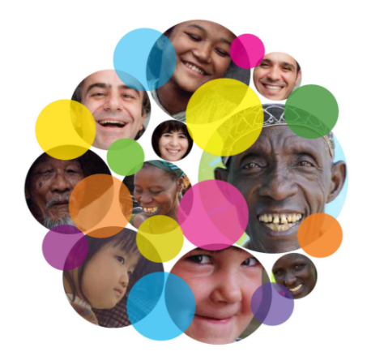
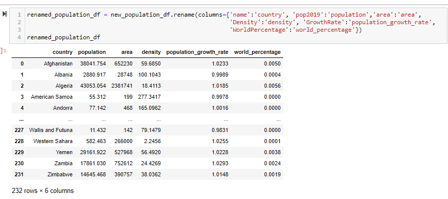
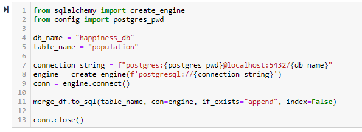
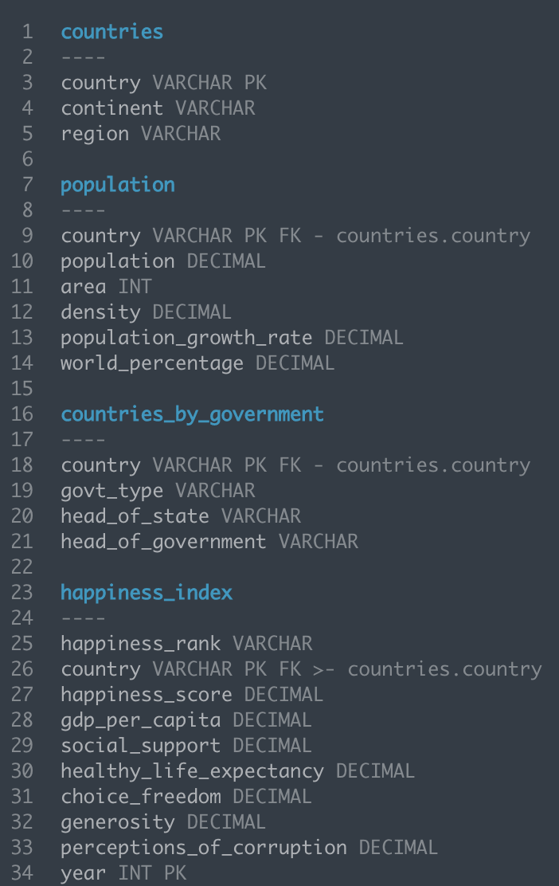
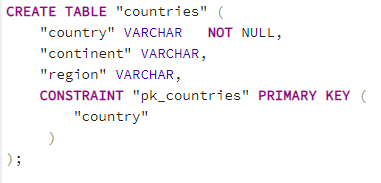
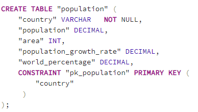

## ELT Project- Happiness Index

## Table of contents
* [General Info](#general-info)
* [Extract](#extract)
* [Transform](#transform)
* [Load](#load)
* [Queries](#queries)
* [Run Data](#run-data)
* [Resources](#resources)
* [Contacts](#contacts)

## General Info
Are you looking for more information for more information on your target market or a new place to move? We have the database for you. Our database compares the Happiness Index of a country and other Geopolitical factors. 

## Extract

Our data came from several sources. We pulled CSV files as well as web scraped data from a government website. The CSVs were from sources such as Kaggle. Although there are 193 countries in the world, our main Happiness Index CSV file included 153 counties that were surveyed. All data sets had country name as a common field. 

## Transform
We imported our data sets into Jupyter notebook to transform our information. We had to reformate and cleaned our CSV files to that they were readable and consistent. We did this by renaming columns and comparing country names to ensure all data was callable in our SQL queries. We also removed null values in areas that would not have been meaningful.

Countries Table:

Government Table 

Happiness Index

Population Table

To organize our data sets we use an Entity Relationship Diagram (ERD) tool. We created sample tables and linked them on primary keys which included country name. WE then exported he schema into PostgreSQL to create our tables. 

## Load
Within postgress, we created tables based on our schema. Then we rand the code in jupyter notebook to import our clean database information into the new tables we made in postgress. 

## Queries 
Once the data was there, we created specific queries to call datasets. These queries were:

We felt these were important representations of our data set because they showed the relationship between a country’s happiness index and their geopolitical factors. 

## Run Data
How to recreate our database:
Clone repo to your desktop. 
Open PG Admin and import Schema
Run all of Schema
Open CSV files notebooks in Jupyter notebook 
Your conda environment needs the following dependencies to run these notebooks:	
	sqlalchemy 
	pandas 
	psycopg2
	Config.py file

Run notebooks completely. 

	User will have to create a file called ‘config.py’ and save it in the main folder of repo. User will need to create a value called ‘postgress_pwd = {password}” whose value is equal to the users postgress password for PG Admin.   

Once the tables are populated in PG Admin, you can run our queries. They are saved in a file called query.sql .

## Resources 

[Kaggle- Happiness Index](https://www.kaggle.com/unsdsn/world-happiness)

[Happiness Index Report](https://worldhappiness.report/ed/2019/#read)

[Government Types](https://www.mapsofworld.com/thematic-maps/types-of-governments.html)

[Kaggle- Country Codes](https://www.kaggle.com/statchaitya/country-to-continent)

[World Population](https://worldpopulationreview.com/)

## Contacts

[Ashley DaCosta](https://github.com/aledacosta93)

[Sai Prasanna Dasari](https://github.com/prasanna0913)

[Tim Samson](https://github.com/timsamson)

[Sara Simoes](https://github.com/Ssimoes48)
